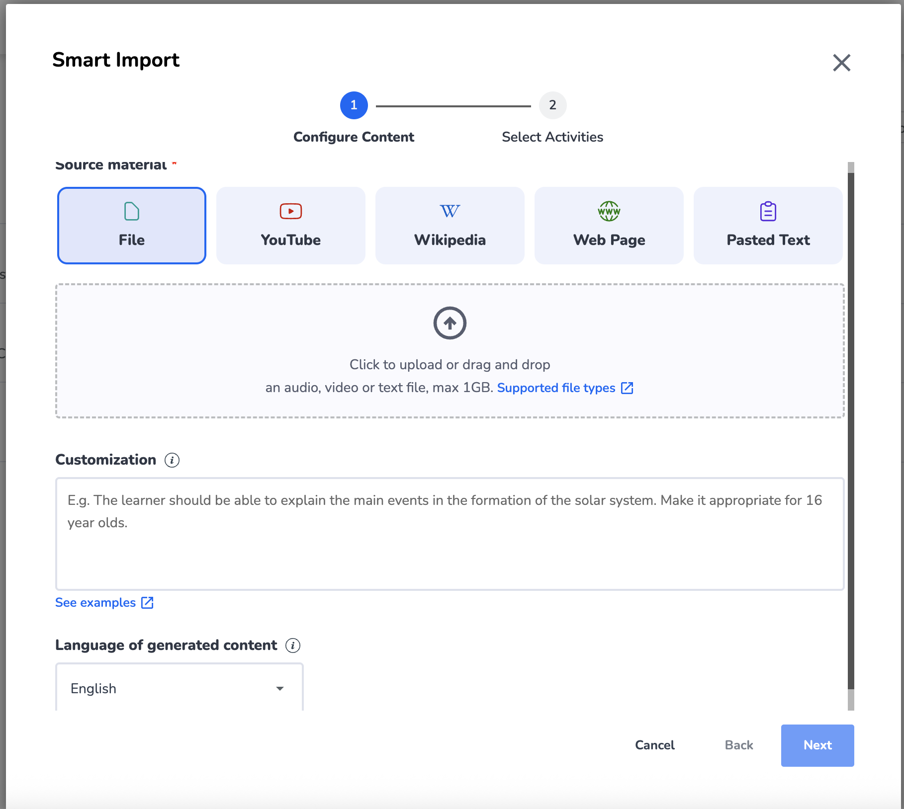
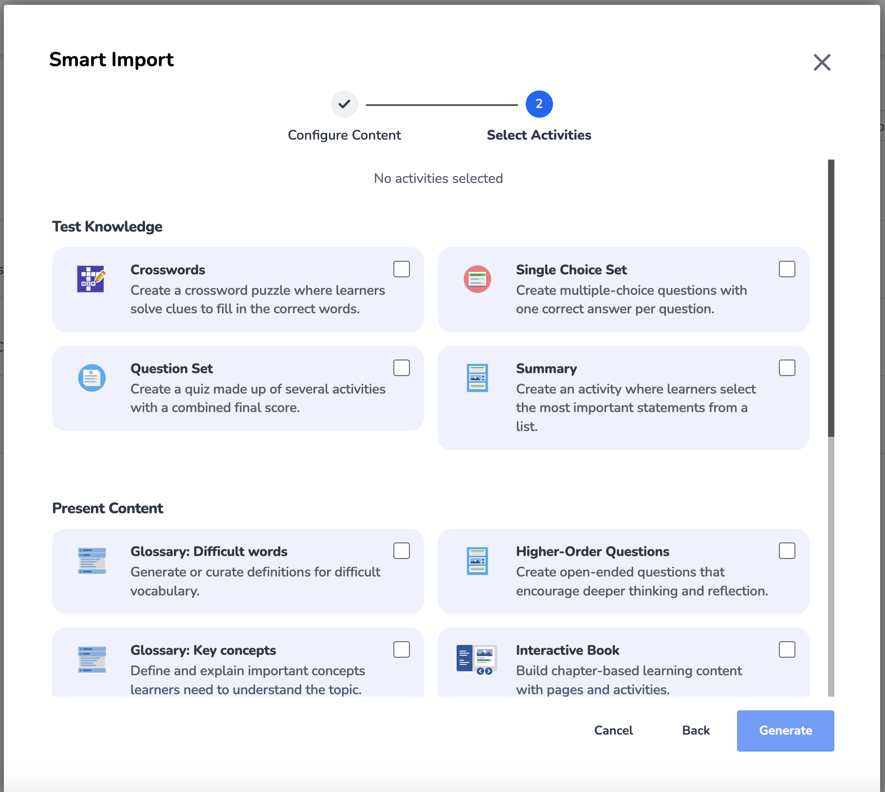

# Smart Import UI reference and proposed design tokens

Date: 19 Sep 2026. Status: reference for later UI design; not an approved implementation plan.

Captured from two H5P.com Smart Import screenshots supplied by Benjamin on 19 Sep 2026. This document translates their visible structure into reusable layout, component and token guidance for LeapLearn. Screenshot text is reference material, not an instruction to change project scope.

The [generator service design, §7](../../specs/2026-09-18-generator-service-design.md#7-the-web-app) remains authoritative. The [phase-2 plan](../2026-09-19-phase-2-generation-pipeline.md) builds the generation pipeline; this reference adds no UI work to that phase. Use it when preparing wireframes and the phase-5 web implementation plan.

## Reference files and confidence

| Reference | Original filename | What is visible |
|---|---|---|
| [Configure content](smart-import/configure-content.png) | Screenshot 2026-09-18 at 8.43.49 am.png | Step 1, File selected, upload area, customisation, language and footer |
| [Select activities](smart-import/select-activities.png) | Screenshot 2026-09-18 at 8.58.38 am.png | Step 2, no activities selected, two activity groups and footer |
| [CSS tokens](smart-import.tokens.css) | New reference asset | Proposed semantic custom properties for a later Svelte/CSS implementation |

Both supplied originals are 1818 × 1628 pixels; copies retain the original bytes. Display scaling, browser zoom and device-pixel ratio are unknown. The lower form content is clipped by the scroll viewport, so the screenshots are not a complete inventory of fields or activity types.

- **Observed:** content hierarchy, visual relationships, labels, selected File tile, active/completed steps and unselected activity cards.
- **Estimated:** colors, spacing, type scale, corner radii, shadow and dimensions. The CSS values are normalized starting points, not extracted H5P source values.
- **Proposed:** responsive layouts, keyboard behaviour, error/loading states and LeapLearn-specific controls. These states are not demonstrated by the screenshots.
- **Unknown:** actual font family, hover/focus appearance, hidden content, exact breakpoints and whether the muted footer buttons are disabled or merely styled that way.

## 1. Visual observations

### Shared shell

A large white dialog sits over a dimmed background. Its title is aligned upper left and a large close control upper right. A centered two-step indicator sits below the title. The form body scrolls inside the dialog; Cancel, Back and the primary action remain at the bottom right. Whitespace separates the title, stepper, field groups and footer.

The visual language uses dark charcoal labels, quieter gray supporting text, pale lavender card surfaces, bright blue selection/action accents and rounded corners. Source icons are simple colored outlines; activity icons are small illustrations. Typeface identification is uncertain: it appears rounded and humanist, with bold labels and headings.

### Step 1: configure content

- Five equal-width source tiles are visible: File, YouTube, Wikipedia, Web Page and Pasted Text.
- File is selected using a blue outline and slightly darker lavender fill.
- A large dashed drop zone contains an upload icon, centered instructions and a file-support link.
- Customisation uses a labelled multiline field, an adjacent information icon and an examples link.
- Language uses a labelled select below the customisation field.
- Footer: Cancel, Back and Next. The body is partially scrolled/cropped.

### Step 2: select activities

- Step 1 changes to a completed check mark; Step 2 becomes the active blue circle.
- A centered selection summary reads “No activities selected”.
- Activity choices form a two-column grid, grouped under “Test Knowledge” and “Present Content”.
- Each rounded card contains an icon, bold title, short explanation and a checkbox near the upper-right corner.
- Visible cards include Crosswords, Single Choice Set, Question Set, Summary, two glossary options, Higher-Order Questions and Interactive Book. The last row is clipped.
- Footer: Cancel, Back and Generate. No selected activity-card state is shown.

## 2. Token proposal

The companion CSS file is the canonical starting point for these **proposed** values. Import it only during UI implementation; it is not currently wired into the application. Semantic names permit later branding changes without renaming components.

| Token family | Initial values | Intent |
|---|---|---|
| Surface | white `#ffffff`; card `#f2f3ff`; selected `#e5eaff` | Quiet form background and recognizable selectable regions |
| Text | strong `#111827`; body `#374151`; muted `#5f6878` | Three levels of hierarchy |
| Accent | reference-like blue `#1b6aff`; primary/link `#1d4ed8` | Selection accent; darker proposed button/link color for contrast |
| Border | structural `#dfe3ec`; control `#7b8492`; selected `#1b6aff` | Distinguish decoration from control boundaries |
| Spacing | 4, 8, 12, 16, 24, 32, 48, 64 px | Shared rhythm rather than per-component arbitrary margins |
| Typography | body 16 px; helper 14 px; card/section title 18/20 px; dialog title 28 px | Normalized scale; do not treat screenshot pixels as CSS pixels |
| Weight/leading | 400, 600, 700; body 1.5, heading 1.2 | Comfortable reading and strong labels |
| Radius | control 6 px; tile 16 px; dialog 12 px | Related shapes at different scales |
| Control targets | minimum 44 × 44 px; fields 48 px high | Proposed usable pointer/touch targets |
| Selection/focus | 2 px selection border; separate 3 px focus outline + 3 px offset | Keyboard focus remains distinguishable from selection |
| Dialog | maximum width 1200 px; maximum height viewport minus 32 px | Adapt the roomy reference without overflowing smaller screens |

Use a system sans-serif stack initially. Do not assume an H5P font or depend on its logo/icon assets. Choose one coherent icon set later; retain text labels so icon color carries no required meaning.

Status colors in the CSS are proposals for future progress/review screens, not observations from these screenshots. Check actual text/background pairings and keyboard focus against the project's accessibility target during implementation.

## 3. Component and interaction contracts

| Component | Proposed implementation contract |
|---|---|
| Import dialog | Labelled modal dialog with focus management, inert background, visible Close and focus restored to the launcher. Title and footer outside the scrollable body. Close/Cancel with dirty-input confirmation only when input would be lost. |
| Step indicator | Ordered list with `aria-current="step"`; active, upcoming and completed treatments. A completed mark includes an accessible label. Back preserves form data. |
| Source picker | Single-choice radio group. Entire tile activates its radio; keyboard arrows move within the group. Selected fill/border and visible state indicator; separate focus outline. |
| Upload zone | Real labelled file input plus keyboard-operable choose-file control. Drag/drop supplements browsing. Show filename, remove/replace control, validation errors and progress. |
| Customisation field | Labelled textarea. Keep examples and help separate from the placeholder; example objectives are guidance, not submitted text. |
| Language select | Labelled select with a visible current value. Generated-content language is distinct from the CLI-only bilingual mode. |
| Activity picker | Native checkbox per card, with title and description as accessible name/description. Whole label is clickable. Selected card uses the same selection tokens as a source tile. |
| Activity counts | Show counts only where meaningful, distinguish packages from items, and keep number controls outside the checkbox label's click target. |
| Selection summary | “3 activity types selected” rather than an ambiguous count. Show planned package/item totals separately once known. Announce changes politely without moving focus. |
| Footer | Cancel → Back → Next/Generate. Step 1 Next validates source input; Step 2 Generate requires a valid selection and budget checks. Explain a blocked action nearby. Prevent duplicate submissions while dispatching. |
| Information/help | Explicitly labelled button/link. Help must be keyboard accessible; do not require hover. |

Preserve a 2 px transparent border on unselected tiles so selection does not shift the layout. Let activity descriptions wrap naturally; align cards through the grid rather than truncating descriptions to force equal heights.

### States to design beyond the screenshots

1. Empty, valid and invalid source; unsupported format; oversize file; failed extraction.
2. Uploading, upload failure and retry; replacement of a selected source.
3. Available, selected and unavailable activity types; zero selection; invalid quantity.
4. Generating, ready, partially failed, failed and budget exhausted.
5. Suggested alignment, human-reviewed alignment, unsupported criteria and accepted/rejected revision.

Only states 1–3 and generation submission belong in this wizard. Results, evidence review and per-activity regeneration belong on Import Detail, as specified in the service design. The screenshots supply no visual reference for those later screens.

## 4. Responsive proposal

These are design starting points, not observed breakpoints:

- **Wide, around 1024 px and up:** source grid with four or five columns according to the available sources; activity grid with two columns; 32–48 px dialog body padding.
- **Medium, around 640–1023 px:** source grid with two or three columns; activity grid with two columns only when descriptions remain readable; 24 px body padding.
- **Narrow, below about 640 px:** one-column activity cards; two-column source tiles or one column if labels wrap poorly; 16 px padding; dialog becomes a full-height sheet. Footer can wrap while preserving action order.
- Keep the dialog body as the single intended form scroll region. Allow the header to compact on short screens so sticky chrome does not consume the viewport. Avoid fixed card heights and horizontal scrolling at enlarged text sizes.

Illustrative grid rules, not a finished component:

```css
.source-grid {
  display: grid;
  grid-template-columns: repeat(auto-fit, minmax(min(100%, 10rem), 1fr));
  gap: var(--ll-space-4);
}
.activity-grid {
  display: grid;
  grid-template-columns: repeat(2, minmax(0, 1fr));
  gap: var(--ll-space-6);
}
@media (max-width: 40rem) {
  .activity-grid { grid-template-columns: minmax(0, 1fr); }
}
```

## 5. Adaptation to the approved LeapLearn design

| Screenshot detail | LeapLearn treatment |
|---|---|
| Smart Import title | Use a provisional task-oriented title such as “Create activities”; final product naming remains open. |
| File / YouTube / Wikipedia / Web Page / Pasted Text | File, Web Page and Pasted Text fit initial web scope. YouTube and audio/video are phase 6. Wikipedia can use Web Page; a separate integration is not approved. Only display implemented source capabilities. |
| “max 1GB” upload copy | Do not copy. Read effective limits from application configuration: currently provisional 200 MB/file, 90 minutes audio, 300,000 text characters, with no silent truncation. Advertise only supported formats and capabilities. |
| Generic customisation | Retain audience, tone and learning-objective guidance. Add the approved unit-of-competency input/selection under Alignment. |
| Activity-card categories | Keep Test Knowledge / Present Content, but populate from the approved shared content types and implemented producers, not a screenshot transcription. |
| Glossary: difficult words / key concepts | Possible future presets over an existing supported type; not new H5P types or approved v1 features. Backend mapping cannot be inferred from the screenshots. |
| Higher-Order Questions | Inspiration for a future Essay preset, not evidence of its backend type. Keep the approved Essay contract. |
| Single Choice Set | Keep its native multi-question form; do not introduce an extra container mode. |
| Quantity selection | MultiChoice, TrueFalse and Essay are one item per package; the planner can request several packages. A QuestionSet contains supported child questions. Make that distinction visible. |
| Interactive Book | Require at least one compatible constituent. The locked contract excludes Flashcards and Crossword; explain that those remain standalone exports and do not silently promise inclusion in the Book. |
| Review/edit expectations | v1 supports preview, regenerate with a note, drop/restore and alignment review. Field editing, importing existing H5P for editing and the full H5P editor remain out of scope. |

## 6. Handoff checklist for the web design plan

- Produce desktop and narrow-screen wireframes for both wizard steps using these proposed tokens.
- Review selected, focus, invalid, uploading and unavailable states; the source screenshots show only a subset.
- Confirm final font/icon choices and contrast; the CSS is a starting palette, not an audited design system.
- Show evidence/criteria and package-count semantics with real phase-2 output in the subsequent Import Detail design.
- Keep sources/types/limits driven by implemented capabilities and configuration.
- Test keyboard-only operation, text enlargement, screen-reader names and the footer at short viewport heights.
- Treat these references as a guide to hierarchy and flow. Do not treat competitor screenshots as approval for extra features, claims or limits.

## Screenshots

### Reference 1 — Configure content



### Reference 2 — Select activities


